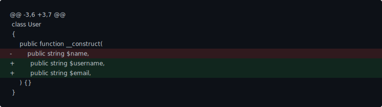
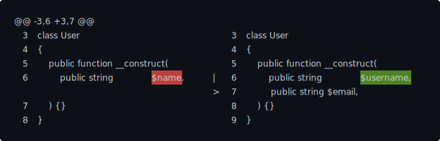

# Alto Code Diff

A modern PHP library to generate, render and apply diffs, featuring advanced algorithms, versatile rendering, and full
patching support.

---

&nbsp; [](https://github.com/PhpAlto/code-diff)
&nbsp; [](https://github.com/PhpAlto/code-diff/actions)
&nbsp; [](https://packagist.org/packages/alto/code-diff)
&nbsp; [](https://github.com/sponsors/smnandre)
&nbsp; [](./LICENSE)

## Features

### Advanced Diff Algorithms

- **Myers Diff Algorithm (default)**: Fast and accurate line-by-line and word-by-word diffing (O(ND)).
- **LCS Diff Algorithm**: Opt-in Longest Common Subsequence engine (O(MN) time and memory) for deterministic academic use cases.
- **Binary Detection**: Automatic detection and rejection of binary content.

### Versatile Rendering

Visualize and format diffs for any output medium:

#### HTML Output



#### ANSI Side-by-Side



### Full Patching Support

- **Unified Diff Parsing**: Parse standard unified diff patches into objects.
- **Patch Application**: Apply patches to files with "fuzz" factor support.
- **Multi-file Bundles**: Handle complex patches affecting multiple files.

## Requirements

- PHP 8.3 or higher

## Installation

```bash
composer require alto/code-diff
```

## Quick Start

### Basic Diff

```php
use Alto\Code\Diff\Diff;
use Alto\Code\Diff\Renderer\UnifiedRenderer;

$old = "line1\nline2\nline3\n";
$new = "line1\nline2 modified\nline3\n";

$result = Diff::build()->compare($old, $new);

$renderer = new UnifiedRenderer('old.txt', 'new.txt');
echo $renderer->render($result);
```

Output:

```diff
--- old.txt
+++ new.txt
@@ -1,3 +1,3 @@
 line1
-line2
+line2 modified
 line3
```

### Word-Level Diff

```php
$result = Diff::build()
    ->withWordDiff()
    ->compare($old, $new);
```

### HTML Output

```php
use Alto\Code\Diff\Renderer\HtmlRenderer;

$renderer = new HtmlRenderer(
    showLineNumbers: true,
    wrapLines: false,
    classPrefix: 'diff-'
);

echo $renderer->render($result);
```

### JSON Output

```php
use Alto\Code\Diff\Renderer\JsonRenderer;

$renderer = new JsonRenderer(prettyPrint: true);
echo $renderer->render($result);
```

### ANSI Side-by-Side Output

```php
use Alto\Code\Diff\Renderer\AnsiSideBySideRenderer;

$renderer = new AnsiSideBySideRenderer(
    showLineNumbers: true,
    width: 120
);

echo $renderer->render($result);
```

## Configuration Options

### Context Lines

Control how many unchanged lines to show around changes:

```php
$result = Diff::build()
    ->contextLines(5)  // Default is 3
    ->compare($old, $new);
```

### Ignore Whitespace

Ignore whitespace differences:

```php
$result = Diff::build()
    ->ignoreWhitespace()
    ->compare($old, $new);
```

### Size Limits

Set maximum input size (default 5MB):

```php
$result = Diff::build()
    ->maxBytes(10_000_000)  // 10MB
    ->compare($old, $new);
```

## Parsing and Applying Patches

### Parse a Unified Diff

```php
use Alto\Code\Diff\Patch\UnifiedParser;

$patch = <<<'PATCH'
--- old.txt
+++ new.txt
@@ -1,3 +1,3 @@
 line1
-line2
+line2 modified
 line3
PATCH;

$parser = new UnifiedParser();
$bundle = $parser->parse($patch);

foreach ($bundle->files() as $file) {
    echo "File: {$file->oldPath} -> {$file->newPath}\n";
    echo "Hunks: " . count($file->result->hunks()) . "\n";
}
```

### Apply a Patch

```php
use Alto\Code\Diff\Patch\PatchApplier;

$original = "line1\nline2\nline3\n";

$applier = new PatchApplier();
$patched = $applier->apply($original, $patch);

echo $patched;
// Output: line1\nline2 modified\nline3\n
```

> **Note:** `PatchApplier::apply()` accepts a single-file patch. For multi-file diffs, parse the patch and call `applyBundle()` instead.

### Apply Patch with Fuzz Factor

```php
$applier = new PatchApplier(fuzz: 2);
$patched = $applier->apply($original, $patch);
```

### Apply Patch to Multiple Files

```php
use Alto\Code\Diff\Model\DiffBundle;

$files = [
    'file1.txt' => "content1\n",
    'file2.txt' => "content2\n",
];

$applier = new PatchApplier();
$patchedFiles = $applier->applyBundle($files, $bundle);
```

## Emitting Unified Diffs

### From DiffResult

```php
use Alto\Code\Diff\Patch\UnifiedEmitter;

$result = Diff::build()->compare($old, $new);

$emitter = new UnifiedEmitter();
$patch = $emitter->emit($result);
```

### From DiffBundle

```php
use Alto\Code\Diff\Model\DiffBundle;
use Alto\Code\Diff\Model\DiffFile;

$files = [
    new DiffFile('file1.txt', 'file1.txt', $result1),
    new DiffFile('file2.txt', 'file2.txt', $result2),
];

$bundle = new DiffBundle($files);
$emitter = new UnifiedEmitter();
$patch = $emitter->emit($bundle);
```

## Renderer Options

### UnifiedRenderer

```php
new UnifiedRenderer(
    oldLabel: 'a/file.txt',  // Label for old version
    newLabel: 'b/file.txt'   // Label for new version
);
```

### HtmlRenderer

```php
new HtmlRenderer(
    showLineNumbers: true,      // Show line numbers
    wrapLines: false,           // Wrap long lines
    classPrefix: 'diff-'        // CSS class prefix
);
```

### JsonRenderer

```php
new JsonRenderer(
    prettyPrint: true  // Format with indentation
);
```

### AnsiSideBySideRenderer

```php
new AnsiSideBySideRenderer(
    showLineNumbers: true,  // Show line numbers
    width: 120              // Terminal width
);
```

## Advanced Usage

### Custom Diff Engine

You can choose between the built-in engines or implement your own.

**MyersDiffEngine** (Default):
Uses the O(ND) Myers algorithm. Best for most use cases, especially when differences are small.

**LcsDiffEngine**:
Uses the standard O(MN) LCS algorithm. Enable it explicitly with `->withEngine(new LcsDiffEngine())` only for small inputs, because its quadratic memory footprint is intended for controlled, academic scenarios.

```php
use Alto\Code\Diff\Engine\LcsDiffEngine;

$result = Diff::build()
    ->withEngine(new LcsDiffEngine())
    ->compare($old, $new);
```

### Implementing a Custom Engine

```php
use Alto\Code\Diff\Engine\DiffEngineInterface;

class MyCustomEngine implements DiffEngineInterface
{
    public function diff(string $old, string $new, Options $opts): DiffResult
    {
        // Custom implementation
    }
}

$result = Diff::build()
    ->withEngine(new MyCustomEngine())
    ->compare($old, $new);
```

### Working with Git Patches

The library supports parsing git-style unified diffs with headers:

```php
$patch = <<<'PATCH'
diff --git a/file.txt b/file.txt
index abcdef..123456 100644
--- a/file.txt
+++ b/file.txt
@@ -1,3 +1,3 @@
 line1
-line2
+line2 modified
 line3
PATCH;

$parser = new UnifiedParser();
$bundle = $parser->parse($patch);

// Access headers
$file = $bundle->files()[0];
$file->headers['diff'];   // 'diff --git a/file.txt b/file.txt'
$file->headers['index'];  // 'index abcdef..123456 100644'
```

## Documentation

For more detailed information, please refer to the documentation in the `docs/` directory:

- [API Reference](docs/api-reference.md)
- [Architecture](docs/architecture.md)
- [Basic Text Comparison](docs/basic-text-comparison.md)
- [File Comparison](docs/file-comparison.md)
- [Git Integration](docs/git-integration.md)
- [Patch Operations](docs/patch-operations.md)
- [Rendering Options](docs/rendering-options.md)
- [Advanced Scenarios](docs/advanced-scenarios.md)
- [Examples](docs/examples.md)

## Testing

Run the test suite:

```bash
vendor/bin/phpunit
```

Run tests with coverage:

```bash
vendor/bin/phpunit --coverage-text
```

## License

This project is licensed under the [MIT License](./LICENSE).
