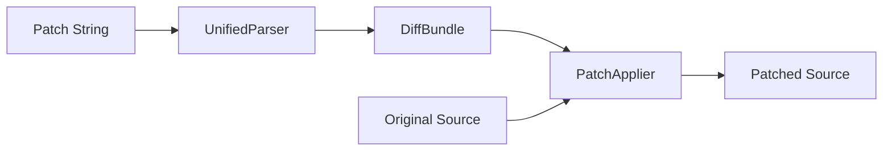

# Architecture

This document describes the high-level architecture of the `alto/code-diff` package.

## Overview

The package is designed around a few key concepts:
- **Engines** compute the raw difference between strings.
- **Models** represent the diff structure (files, hunks, edits).
- **Parsers** and **Emitters** convert between string representations (like Unified Diff) and the object model.
- **Appliers** apply patches to text.
- **Renderers** visualize the diffs in various formats.

## Core Components

### 1. Diff Facade (`Diff`)
The `Alto\Code\Diff\Diff` class is the main entry point for generating diffs. It provides a fluent interface to configure options (context lines, whitespace handling, etc.) and delegates the actual computation to a `DiffEngineInterface`.

```php
$diff = Diff::build()
    ->ignoreWhitespace()
    ->contextLines(3)
    ->compare($old, $new);
```

### 2. Engines (`Engine`)
Engines implement `Alto\Code\Diff\Engine\DiffEngineInterface`. They are responsible for the algorithmic core of finding differences.

- **LcsDiffEngine**: Implements the Longest Common Subsequence algorithm.
- **MyersDiffEngine**: Implements the Myers diff algorithm (often faster and produces more human-readable diffs).

### 3. Models (`Model`)
The domain model represents the structure of a diff:

- **DiffResult**: The result of comparing two strings. Contains a list of `Hunk`s.
- **DiffBundle**: Represents a multi-file diff (e.g., a patch file containing changes for multiple files).
- **DiffFile**: Represents a single file within a bundle (old path, new path, and `DiffResult`).
- **Hunk**: A contiguous block of changes, containing a list of `Edit`s.
- **Edit**: A single atomic change (insertion, deletion, or unchanged line).

### 4. Parser (`Patch\UnifiedParser`)
The `UnifiedParser` is responsible for parsing a standard Unified Diff string into a `DiffBundle` object. It handles:
- File headers (`---`, `+++`)
- Hunk headers (`@@ -1,2 +1,2 @@`)
- Hunk bodies (lines starting with ` `, `-`, `+`)

### 5. Emitter (`Patch\UnifiedEmitter`)
The `UnifiedEmitter` does the reverse of the parser: it takes a `DiffBundle` or `DiffResult` and generates a valid Unified Diff string.

### 6. Applier (`Patch\PatchApplier`)
The `PatchApplier` applies a patch (Unified Diff) to a source string.
- Supports "fuzz" factor to apply patches even if context lines don't match exactly.
- Can apply patches to single strings or multiple files (via `applyBundle`).
- Validates input size limits.

### 7. Renderers (`Renderer`)
Renderers implement `Alto\Code\Diff\Renderer\RendererInterface` to visualize diffs.

- **UnifiedRenderer**: Standard unified diff output (similar to `git diff`).
- **HtmlRenderer**: Renders diffs as HTML for web display.
- **JsonRenderer**: JSON representation for API responses.
- **AnsiSideBySideRenderer**: Side-by-side diff for terminal output.

## Data Flow

### Diff Generation


### Patching


